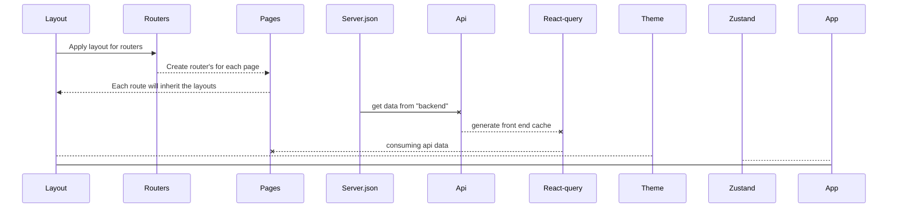

# About project

This is a front end project using reactJs + vite + typescript 
The goal of this project its simulate a system to collect user permissions.

## Requirements

 - NPM
 - NodeJs 20
 - ReactJs 18
 - Vite 5

## Configs

To run this project, you **must** use **npm** as dependency manager. The reason is, i'm using my own eslint lib that i publish just in npm repository (I promise i will publish i the others tools like yarn 😬😬). 
The api that return the consents will be empty by default, so the user will need to add at least one item using the form present into the system to be able to see the table

 1. ***npm i***
 2. ***npm run dev:server***
 3. ***npm run dev***
 4. ***npm run test***

## Main Lib's used in this project

 - Mui
	 - As a project requirements, we need to use Mui as style Lib to create or components. I enjoyed the opportunity to follow 2 approach's in my style. First was create a theme struct with colors, space, etc and use as props inside the Mui components, and the other one was redefine the default Mui theme. 
 - Axios
	 - Call api's
 - React query 
	 - Make cache on front end side
 - React hook form
	 - Form validation and prevent re-renders
 - Zod
	 - Combine with react-hook-form to validate our fields. In this project was not necessary, but i wanted to include because is a powerfull lib to use 
 - Json-server
	 - To create our fakes api's simulating our back-end
 - Zustand
	 - State management. In this project, to be honest, i dont think we need a provider, but i added just to show a new tool and because it was a project requirement 
 - Jest
	 - Unit test
 - React test library
	 - Unit test
 - Vitest
	 - Unit test

## Project struct 
#### At this point, we will go through in the project to understand the purpose of each folder 

### /src
 - Api
	 - Our api folder are the place where we create our query and mutations for each end point that we will use. If we have a get and post that call the same end point, we should create just on folder with 2 files, queries and mutations, and create the hook to call this end points. So, imagine that our application call 4 differents end points, called user/, list/, cart/, login. So our folder should present this struct: 
		 - user
			 - query
			 - mutations
		 - list
			 - query
			 - mutations
		 - cart
			 - query
			 - mutations
		 - login
			 - query
			 - mutations
 - Assets
	 - In our application we enjoy the opportunity that mui proved to us to use mui icons, but the purpose of this folder was to save our assets like custom icons and font's.
 - Axios
	 - Api folder was created to store all files related to axios. Here in our project we just have a basically axios instance where we use to call our api working together with react query, but we could have another thinks like middlewares, refresh token logics.
 - Components
	 - Our global components that we will use around our application. Also the unit tests for each global component created
 - configs
	 - This folder can store a lot of things, but in our case, they stored the enum with router's paths and the sideBar options menu
 - layouts
	 - Here we could create different layout for each part of our application. For exemple, If the user is logged in, we must present, with component header containing the user's avatar, logout options, but if the user is not logged we need our theme provider but without the header for exemple.
 - pages
	 - Containing the pages inside our application. Each page can have a component folder as well, to create components that will be use just in this part of the system
 - router
	 - Application routers and where we apply our layouts
 - storage
	 - Our hooks that we need to store global informations that will be use in differents part in our applications
 - theme
	 - Here in our theme we have the component that create a custom theme for MUI. We have the tokens and the global styles that will be used in all part of our system, like reset default theme present in our html

## Diagrams

